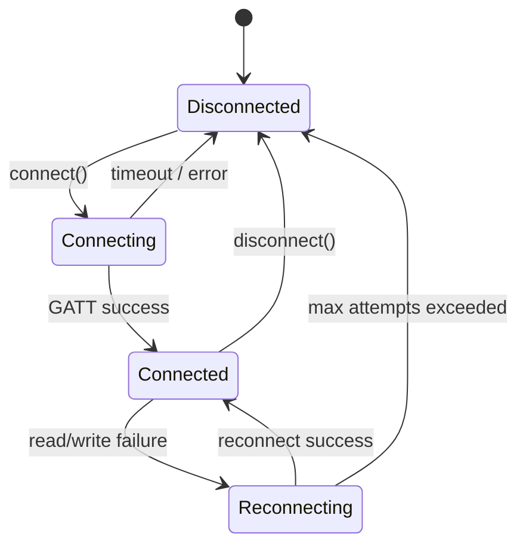
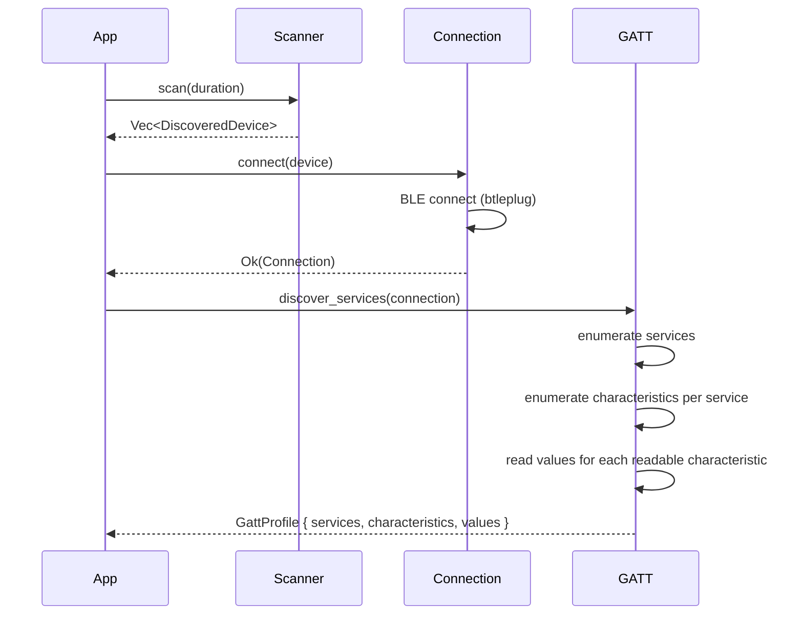

# libstealthtech Architecture

## Crate Dependency Graph

```
stealthtech (CLI) ──► libstealthtech-core ──► btleplug (platform BLE)
                           ├── ble::{Scanner, Connection, GATT}
                           └── device::StealthTechDevice
                                    │
                      libstealthtech-protocol  (shared, no native deps)
                           ├── characteristics (UUIDs, constants)
                           ├── commands (encode/decode)
                           └── state (DeviceState tracking)
                                    │
              ┌─────────────────────┼─────────────────────┐
              ▼                     ▼                     ▼
    libstealthtech-core   libstealthtech-wasm   libstealthtech-bridge
       (BLE transport)     (Web Bluetooth)       (Swift/Kotlin FFI)
```

- **libstealthtech-protocol** (`rust/protocol/`) -- WASM-compatible protocol types with
  zero native dependencies. GATT UUIDs, command encoding/decoding, device state tracking.
- **libstealthtech-core** (`rust/core/`) -- BLE transport layer and high-level device API.
  Depends on protocol crate and btleplug.
- **stealthtech** (`rust/cli/`) -- CLI binary with subcommands for end-user control
  (volume, input, mode) and reverse engineering (`stealthtech sniff`). Includes a web
  server with embedded Web Bluetooth UI.
- **libstealthtech-wasm** (`rust/wasm/`) -- WebAssembly bindings for the protocol crate,
  used by the standalone Web Bluetooth interface at stealthtech.app.
- **libstealthtech-bridge** (`rust/bridge/`) -- native FFI bindings via uniffi for
  Swift/Kotlin (future).
- **btleplug** -- cross-platform BLE library (CoreBluetooth on macOS, bluez on Linux,
  WinRT on Windows).

## BLE Connection State Machine



### States

| State | Description |
|-------|-------------|
| **Disconnected** | No active BLE connection. Initial state and terminal failure state. |
| **Connecting** | BLE connection attempt in progress. Includes GATT service discovery. |
| **Connected** | Active BLE connection with discovered GATT profile. Ready for reads/writes. |
| **Reconnecting** | Automatic reconnection after an unexpected disconnection or failed operation. Uses exponential backoff up to a configurable maximum number of attempts. |

### Transitions

| From | To | Trigger |
|------|----|---------|
| Disconnected | Connecting | `connect()` called by application |
| Connecting | Connected | BLE connection established and GATT services discovered |
| Connecting | Disconnected | Connection timeout or BLE error |
| Connected | Reconnecting | A read or write operation fails due to connection loss |
| Connected | Disconnected | `disconnect()` called by application |
| Reconnecting | Connected | Reconnection succeeds and GATT profile is rediscovered |
| Reconnecting | Disconnected | Maximum reconnection attempts exceeded |

## GATT Discovery Flow



### Discovery Steps

1. **Scan** -- `Scanner::scan()` listens for BLE advertisements matching known
   StealthTech device names for a configurable duration.
2. **Connect** -- `Connection::connect()` establishes a BLE connection to a discovered
   peripheral and performs initial GATT service discovery.
3. **Discover Services** -- `GATT::discover_services()` walks the full GATT attribute
   table: services, included services, characteristics, and descriptors.
4. **Enumerate Characteristics** -- For each service, all characteristics are recorded
   with their UUID, properties (Read/Write/Notify/etc.), and handle.
5. **Read Values** -- Every characteristic with the Read property is read and its current
   value is captured as raw bytes.
6. **Return Profile** -- The complete `GattProfile` struct is returned, containing all
   services, characteristics, and their current values.

## Protocol Layer -- Characteristic Map

All characteristics have been **fully mapped**. They share a base UUID encoding
"excelpoint.com" in ASCII (`65786365-6c70-6f69-6e74-2e636f6d`), with the last
2 bytes varying per characteristic. See `rust/protocol/src/characteristics.rs`.

| Suffix | Constant | Name | Purpose |
|--------|----------|------|---------|
| 0001 | `CHAR_UPSTREAM` | UpStream | Notify -- device → host status updates |
| 0002 | `CHAR_DEVICE_INFO` | DeviceInfo | Write -- request state dump / firmware version |
| 0003 | `CHAR_EQ_CONTROL` | EqControl | Write -- volume, bass, treble, center, rear, mute, quiet, preset |
| 0004 | `CHAR_AUDIO_PATH` | AudioPath | Write -- balance, power |
| 0005 | `CHAR_PLAYER_CONTROL` | PlayerControl | Write -- BT media play/pause/skip |
| 0006 | `CHAR_SYSTEM_LAYOUT` | SystemLayout | Write -- configuration shape |
| 0007 | `CHAR_SOURCE` | Source | Write -- input source selection |
| 0008 | `CHAR_COVERING` | Covering | Write -- fabric type for acoustic tuning |
| 0009 | `CHAR_USER_SETTING` | UserSetting | Write -- user preferences |
| 000a | `CHAR_OTA` | OTA | Write -- over-the-air firmware update |

### Services

| Service | Constant | UUID |
|---------|----------|------|
| StealthTech | `SERVICE_STEALTHTECH` | `65786365-6c70-6f69-6e74-2e636f6d0000` |
| Generic Access | `SERVICE_GENERIC_ACCESS` | `0x1800` |
| Generic Attribute | `SERVICE_GENERIC_ATTRIBUTE` | `0x1801` |
| Device Information | `SERVICE_DEVICE_INFORMATION` | `0x180A` |

See [protocol-mapping.md](protocol-mapping.md) for the complete protocol specification
and [reverse-engineering.md](reverse-engineering.md) for the RE methodology guide.
